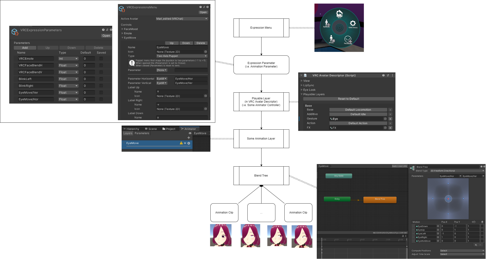

Core idea:

1. Use `Expression Menu` to manipulate `Expression Parameter`.
2. Send `Expression Parameter` to the Animator Controller (one of the `Playable Layer`) by using the same name.
3. Use Blend Tree to blend some Animation Clips according to the values of `Expression Parameter`.